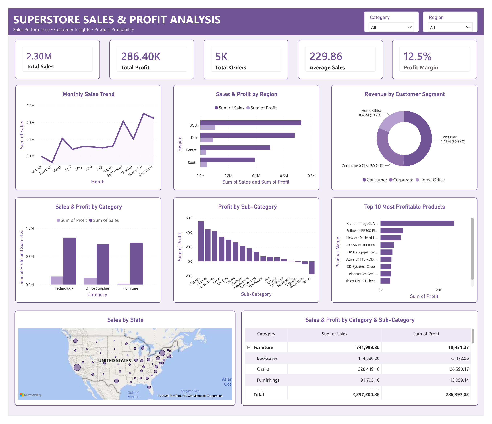

# Superstore Sales & Profit Analysis

## AnalystLab Africa – Week 2 Data Analytics Assignment

### Project Overview

This project analyses the Superstore Sales Dataset using Microsoft Power BI to understand sales performance, profitability, customer segments, regional performance, product categories and sales trends.

The analysis converts the raw sales data into an interactive dashboard that provides management with useful information for business decision-making.

## Business Objective

The objective of this project is to analyse the company's sales and profitability performance, identify important business patterns and provide practical recommendations that can support improved business performance.

The analysis focuses on:

- Overall sales and profit performance
- Regional sales and profitability
- Customer segment performance
- Product category and sub-category performance
- Monthly sales trends
- Most profitable products

## Tools Used

- Microsoft Power BI
- Power Query
- Microsoft Excel
- GitHub

## Data Preparation

The dataset was prepared using Power Query.

The preparation process included:

- Reviewing the dataset structure
- Checking data types
- Changing columns to appropriate data types
- Removing duplicate records
- Checking data quality

The dataset contains 21 columns. The data quality check showed 100% valid values, 0% errors and 0% empty values across the reviewed fields.

## Dashboard Features

The Power BI dashboard contains:

- KPI cards
- Monthly sales trend
- Sales and profit by region
- Revenue by customer segment
- Sales and profit by category
- Profit by sub-category
- Top 10 most profitable products
- Sales by state map
- Category and sub-category matrix
- Interactive slicers

## Key Business Insights

1. The business generated approximately $2.30M in total sales and $286.40K in total profit, with a 12.5% profit margin.

2. The West region records the highest sales performance among the regions shown in the dashboard.

3. The Consumer segment contributes the largest share of revenue at approximately 50.56%.

4. Technology is the strongest product category by sales and profit contribution.

5. Some sub-categories, including Supplies, Bookcases and Tables, generate negative profit and require further review.

## Business Risks

- Low profitability in some product areas may reduce overall profit.
- Heavy reliance on the Consumer segment creates exposure if Consumer demand declines.
- Differences in regional performance may lead to missed opportunities in weaker regions.

## Business Opportunities

- Increase focus on profitable Technology products.
- Strengthen Consumer retention while growing Corporate and Home Office customers.
- Review pricing, discounts and costs of loss-making sub-categories.

## Recommendations

1. Review pricing, discount levels and operating costs for loss-making sub-categories.

2. Continue strengthening the Technology category through appropriate stock availability and targeted promotions.

3. Develop targeted sales and retention strategies for Consumer customers while increasing efforts to grow Corporate and Home Office customers.

4. Investigate weaker regional performance and develop targeted sales and customer strategies.

5. Monitor sales and profit performance regularly using the Power BI dashboard to identify areas requiring management attention.

## Project Outcome

The analysis provides management with a clearer view of sales and profitability performance and highlights areas where the business can protect profit, strengthen high-performing areas and improve weaker areas.

## Project Files

- `Superstore_Sales(1).pbix` – Power BI project file
- `AnalystLab_Africa_Week2_Superstore_Dashboard.pdf` – Dashboard export

  ## Dashboard Preview

